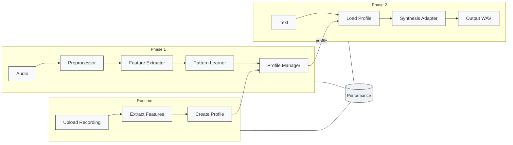

```mermaid
%%{init: {'flowchart': {'useMaxWidth': true}}}%%
flowchart LR
  %% Phase 1: Training
  subgraph Phase1["Phase 1"]
    direction TB
    AU[Audio]
    AP[Preprocessor]
    FE[Feature Extractor]
    PL[Pattern Learner]
    PM[Profile Manager]
    AU --> AP --> FE --> PL --> PM
  end

  %% Phase 2: Inference
  subgraph Phase2["Phase 2"]
    direction TB
    TXT[Text]
    LOAD[Load Profile]
    SY[Synthesis Adapter]
    OUT[Output WAV]
    TXT --> LOAD --> SY --> OUT
  end

  %% Link between phases
  PM -->|profile| LOAD

  %% Runtime flow
  subgraph Runtime["Runtime"]
    direction LR
    UPL[Upload Recording]
    EX[Extract Features]
    CRE[Create Profile]
    UPL --> EX --> CRE
    CRE --> PM
  end

  %% Performance note node
  perf[(Performance)]

  Phase1 --- perf
  Phase2 --- perf
  Runtime --- perf

  %% Styling for larger, clearer diagram
  classDef bigNodes fill:#f8f9fa,stroke:#2b2b2b,stroke-width:1px,font-size:18px;
  classDef perfNode fill:#eef2f7,stroke:#2b2b2b,stroke-width:1px,font-size:16px;
  class AU,AP,FE,PL,PM,TXT,LOAD,SY,OUT,UPL,EX,CRE bigNodes
  class perf perfNode
```
