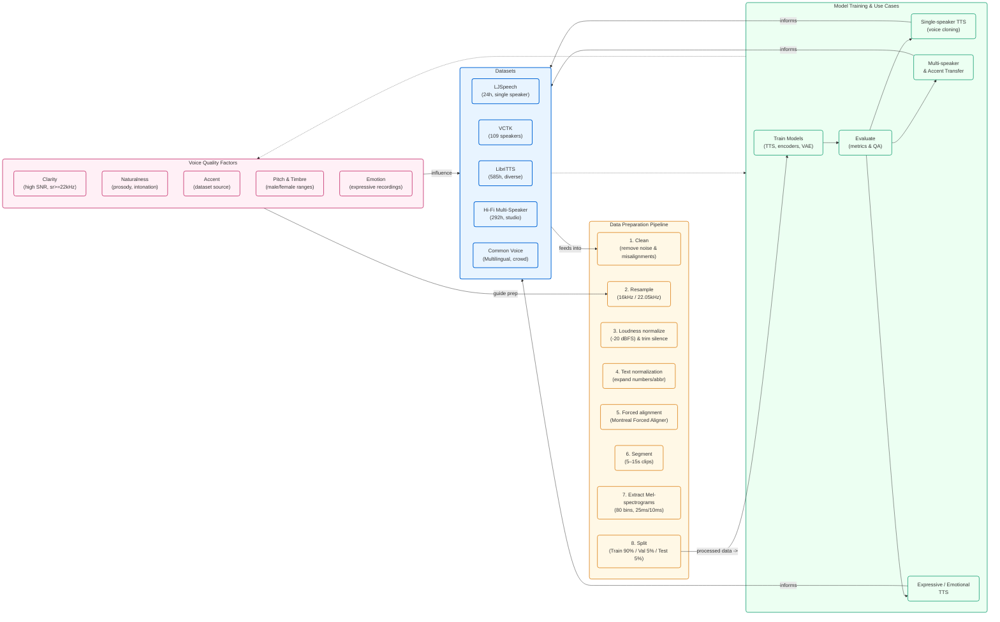

# Task 1: Dataset Analysis

## Datasets I analyzed:
- LJSpeech: 24hr single female, clean English
- VCTK: 109 speakers, UK accents  
- LibriTTS: 585hr audiobooks
- Hi-Fi: 292hr studio quality
- Common Voice: Multilingual crowdsourced

Clean data = clear voice. Noisy data = muffled voice.

#  TTS Dataset Analysis 

##  Dataset Overview

| Dataset Name | Description | Use Case |
|---------------|--------------|-----------|
| **LJSpeech** | Single female (US English), 24h clean studio audio | Clear single-speaker TTS |
| **VCTK** | 109 UK English speakers, 44h total | Accent & multi-speaker TTS |
| **LibriTTS** | 2,456 speakers, 585h diverse audio | Robust large-scale models |
| **Hi-Fi Multi-Speaker** | 10 pro speakers, 292h | Premium quality, emotional TTS |
| **HUI German Corpus** | Multi-speaker German dataset with aligned text | German TTS training |
| **Common Voice** | 9,000+ hours across 60+ languages | Multilingual / low-resource TTS |

---

##  Voice Quality Factors

- **Clarity:**  
  High SNR (>20 dB) and sample rate (22 kHz+) → crisp, clear audio.

- **Naturalness:**  
  Prosody (rhythm, pauses, intonation) = human-like speech.

- **Accent:**  
  Output accent depends on dataset source (US, UK, etc.).

- **Pitch & Timbre:**  
  - Female range: 180–250 Hz  
  - Male range: 100–180 Hz  
  Voice tone comes from speakers’ frequency and vocal traits.

- **Emotion:**  
  Expressive datasets = emotional, realistic voices.

---

##  Dataset Selection Tips

- Match **language**, **accent**, & **speaker style** to your target voice.  
- Use **expressive** data for emotional TTS; **neutral** for assistants.  
- Prefer **high-quality studio recordings** (>20 dB SNR).  
- **Single-speaker** → consistent quality.  
- **Multi-speaker** → diversity and accent coverage.  
- Collect **10–25 h+** for good results; **100 h+** for multi-speaker strength.

---

##  Data Preparation Pipeline

1. Clean dataset — remove noise & misalignments.  
2. Resample audio to 16 kHz / 22.05 kHz.  
3. Normalize loudness to -20 dBFS & trim silence below -40 dB.  
4. Text normalization (expand numbers, abbreviations, etc.).  
5. Forced alignment with **Montreal Forced Aligner**.  
6. Segment audio into 5–15 sec clips.  
7. Extract **Mel-spectrograms** (80 mel bins, 25 ms window, 10 ms hop).  
8. Split:
   - 90% → Train  
   - 5% → Validation  
   - 5% → Test  

---

##  Key Takeaways

- Good **data = good TTS quality**.  
- **LJSpeech** → natural single voice.  
- **VCTK** → diverse accent modeling.  
- **LibriTTS** → large, strong baseline dataset.  
- **Clean preprocessing** ensures consistent speech synthesis.

---

## Mermaid Diagram (rectangular / large layout)

Below is a redesigned Mermaid diagram that lays out the content in a large rectangular shape (top = datasets, right = pipeline steps stacked, bottom = model & use cases, left = voice quality factors). This creates a square/rectangle flow that is visually larger and avoids a long single line. Paste this into GitHub (file view) or a Mermaid previewer (VSCode/mermaid.live).

Notes:
- This layout intentionally places nodes on four sides to form a rectangular / square visual. Multi-line labels enlarge nodes and the overall diagram.
- If you want the rectangle to be even bigger, we can add invisible spacer nodes to increase spacing, or split pipeline steps into grouped subgraphs (I can do that if desired).
- If you want exact styling to match architecture.md, paste that mermaid block or allow me to fetch it and I'll match fonts/colors precisely.

If you want, I can:
- Add spacer nodes to make the rectangle physically larger on render.
- Produce a second diagram that isolates Voice Quality Factors in a separate large panel.
