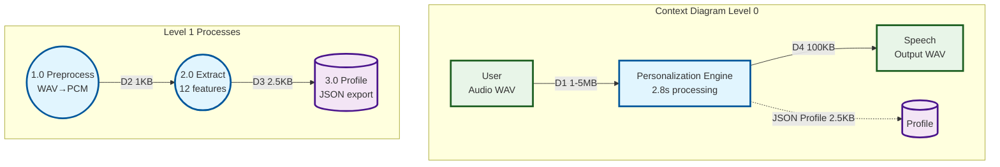
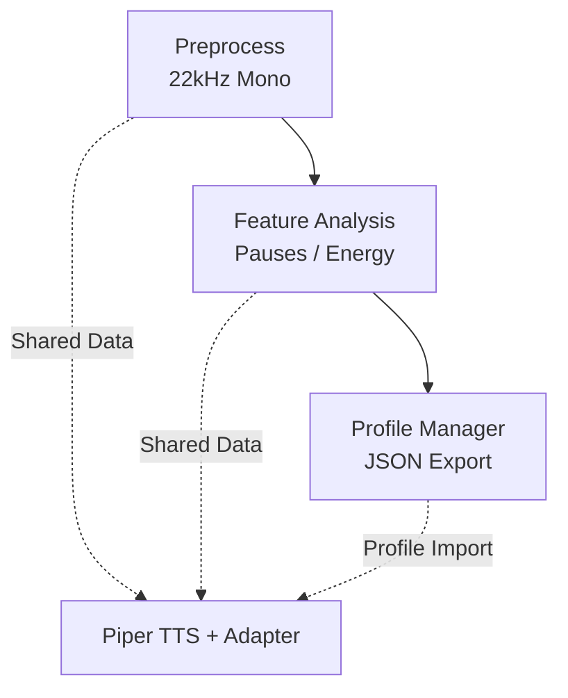
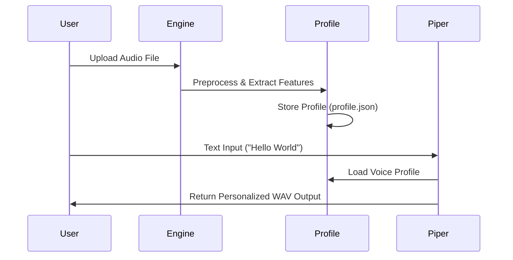

#  Piper TTS Personalization Diagrams

##  Architecture Diagram
See ARCHITECTURE.md

---

##  Data Flow Diagram (Level 0 - Context)

```mermaid
flowchart TD
    %% Context Diagram (Level 0)
    subgraph Level0 ["Context Diagram Level 0"]
        User[User<br/>Audio WAV] -->|D1 1-5MB| Engine[Personalization Engine<br/>2.8s processing]
        Engine -->|D4 100KB| Speech[Speech<br/>Output WAV]
        Engine -.->|JSON Profile 2.5KB| Profile[(Profile)]
    end

    %% Level 1 Processes
    subgraph Level1 ["Level 1 Processes"]
        Preprocess((1.0 Preprocess<br/>WAV→PCM)) -->|D2 1KB| Extract((2.0 Extract<br/>12 features))
        Extract -->|D3 2.5KB| Profile1[(3.0 Profile<br/>JSON export)]
    end

    %% Data Dictionary Table
    classDef process fill:#e1f5fe,stroke:#01579b,stroke-width:3px
    classDef datastore fill:#f3e5f5,stroke:#4a148c,stroke-width:3px
    classDef external fill:#e8f5e8,stroke:#1b5e20,stroke-width:3px

    class User,Speech external
    class Engine,Preprocess,Extract process
    class Profile,Profile1 datastore
```

##  Component Interaction

```mermaid
flowchart TD
  A[Preprocess<br/>22kHz Mono] --> B[Feature Analysis<br/>Pauses / Energy]
  B --> C[Profile Manager<br/>JSON Export]

  A -.->|Shared Data| D[Piper TTS + Adapter]
  B -.->|Shared Data| D
  C -.->|Profile Import| D
```

---

##  Sequence Flow

```mermaid
sequenceDiagram
  participant User
  participant Engine
  participant Profile
  participant Piper

  User ->> Engine: Upload Audio File
  Engine ->> Profile: Preprocess & Extract Features
  Profile ->> Profile: Store Profile (profile.json)
  User ->> Piper: Text Input ("Hello World")
  Piper ->> Profile: Load Voice Profile
  Piper ->> User: Return Personalized WAV Output
```
