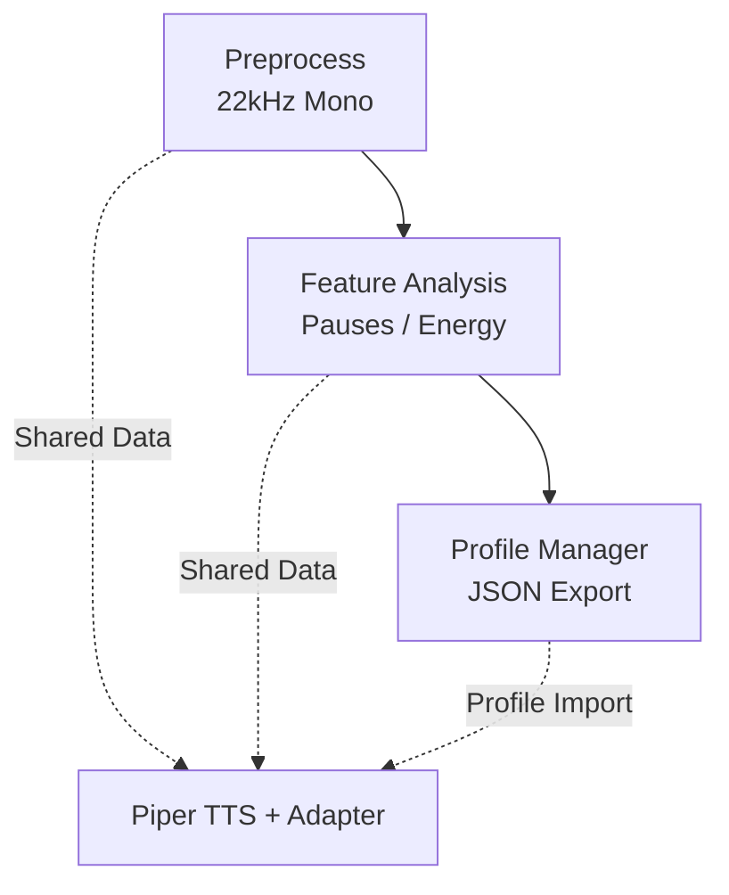
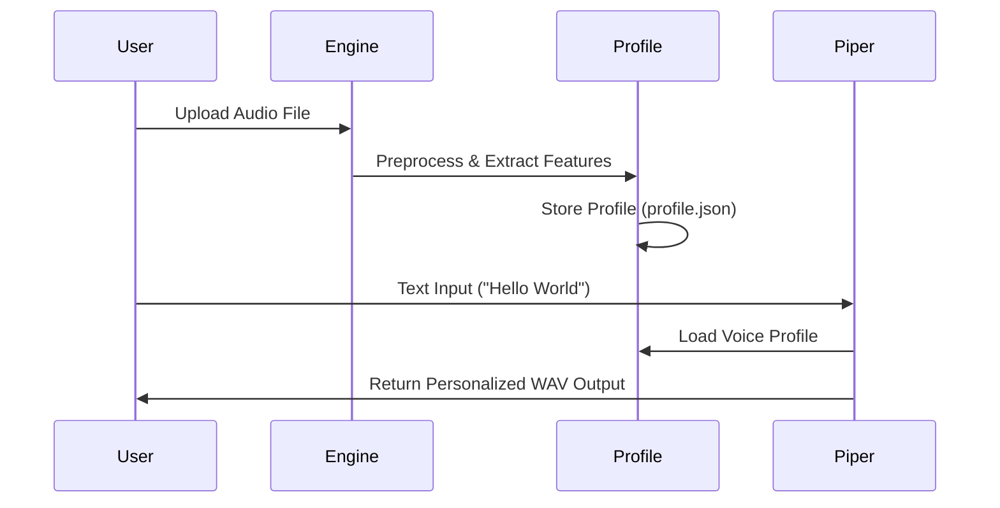

#  Piper TTS Personalization Diagrams

##  Architecture Diagram
See ARCHITECTURE.md

---

##  Data Flow Diagram (Level 0 - Context)

```mermaid
flowchart LR
  U[User<br/>(Audio Input)] -->|2.8s Processing| P[Personalization Engine]
  P --> O[Output<br/>(Personalized Speech)]
  P --> J[JSON Profile<br/>2.5KB Storage]
```

---

##  Component Interaction



---

##  Sequence Flow


