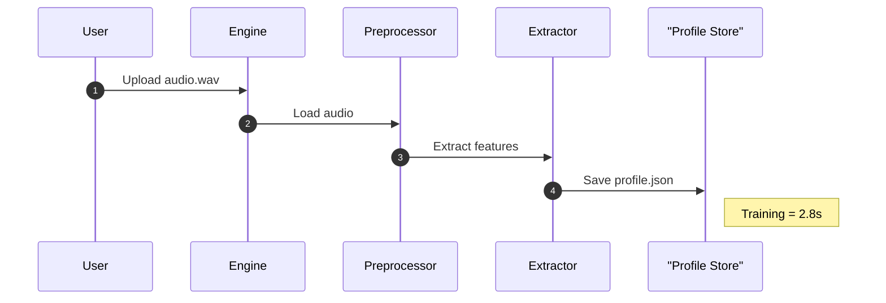
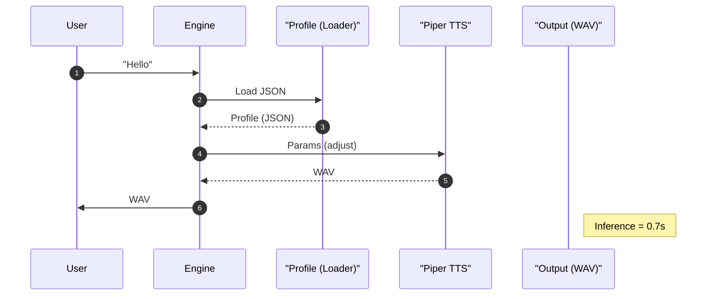

```mermaid
%% Training Sequence
sequenceDiagram
    autonumber
    participant User
    participant Engine
    participant Preprocessor
    participant Extractor
    participant ProfileStore as "Profile Store"

    User->>Engine: Upload audio.wav
    Engine->>Preprocessor: Load audio
    Preprocessor->>Extractor: Extract features
    Extractor->>ProfileStore: Save profile.json

    Note right of ProfileStore: Training = 2.8s
```

```mermaid
%% Inference Sequence
sequenceDiagram
    autonumber
    participant User
    participant Engine
    participant Profile as "Profile (Loader)"
    participant PiperTTS as "Piper TTS"
    participant Output as "Output (WAV)"

    User->>Engine: "Hello"
    Engine->>Profile: Load JSON
    Profile-->>Engine: Profile (JSON)
    Engine->>PiperTTS: Params (adjust)
    PiperTTS-->>Engine: WAV
    Engine->>User: WAV

    Note right of Output: Inference = 0.7s
```
